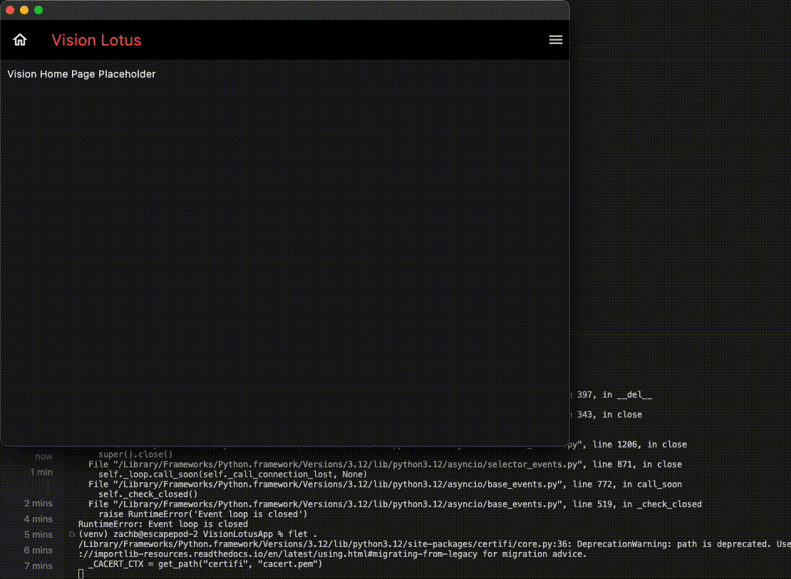

# VisionLotusApp

A prototype companion app designed to serve as a platform for attendees to find information leading up to and during the Vision Leather event.

## Features To Showcase

### DONE

* **Home Page**: Hey, it actually launches, that's the least you can expect to work. That's a miracle.

### TO DO

* **IAM Features**: registration, login, authentication, user profile, etc.
* **Event Schedule**: create event schedule API and a connection for it
* **Auction Information**: Get details on auction happening at the event
* **Maps**: Explore maps to the event location and key locations in the surrounding areas
* **Applications**
  * **Presentaters**: Apply to present your work or ideas at the event
  * **Volunteers**: Sign up for volunteer opportunities at the event
  * **Sponsors**: Learn more about sponsorship opportunities for the event
  * **Vendors**: Apply to be a vendor at the event

## Screenshots

